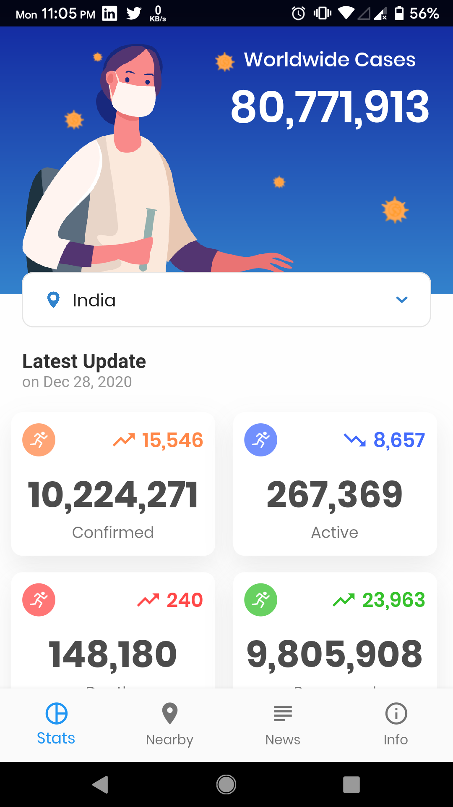
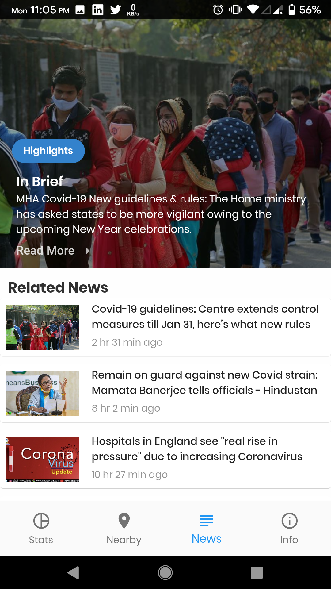
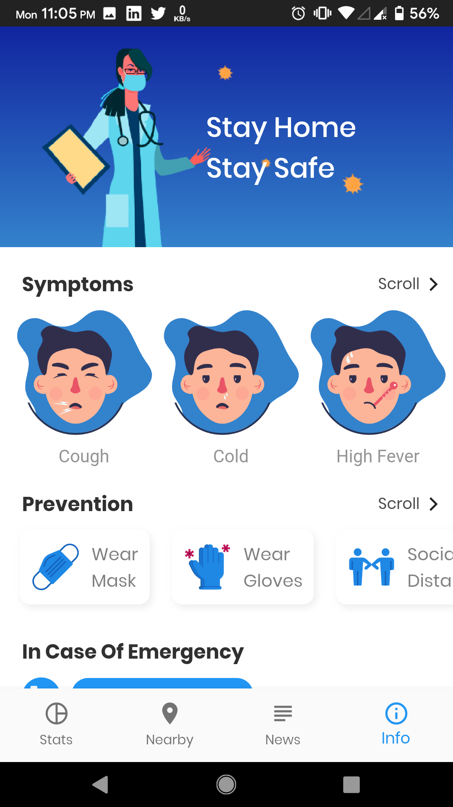

# Covid-19 App

- A simple lightweight Flutter app that helps track the Covid-19 cases in India. 
- It makes use of a free api available which also provided with statewise data.
- The app also shows latest news related to Covid-19 in India.
- It has information of all the symptoms and preventive measures that can be taken.
- All the government contact details are also mentioned in the app itself.
- The Nearby tab is incomplete as the previous aim was to use Google Maps but due to it not being open source wasn't able to implement that.

## Screenshots

              

